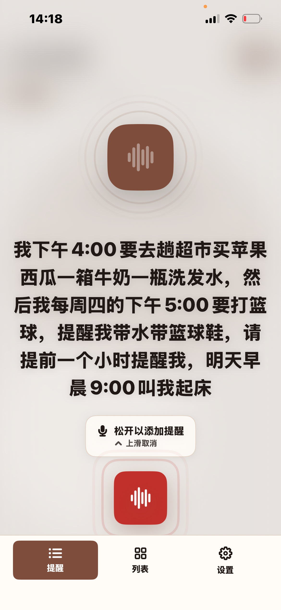
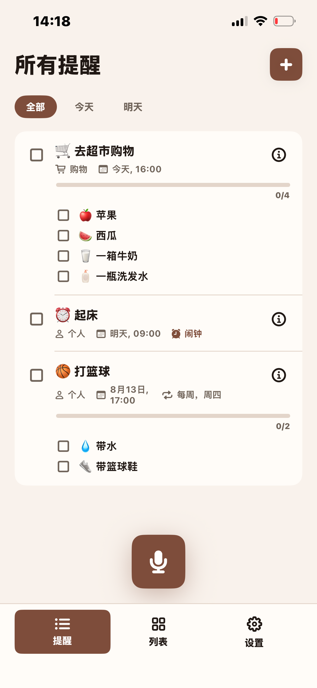

# Remi - AI 帮你整理你提醒事项以及闹钟

朋友们，你还在手动输入文字，设置时间创建你的提醒和闹钟吗？我最近做了个App，叫Remi，我们只需要点一下麦克风，说出来你要做的事情或者需要提醒你做的事情，Remi AI 会自动归类，帮你整理成结构清晰的提醒事项，自动整理好标题，时间，子任务等。重要事情还会闹钟提醒你。这一切AI都会帮你自动整理好，不需要手动输入！！！

我们可以这样说：

> 我下午4点要去趟超市，买苹果，西瓜，一箱牛奶，一瓶洗发水。
> 然后我每周四的下午五点要打篮球，提醒我带水，带篮球鞋，请提前一个小时提醒我
> 明天早晨9点叫我起床

Remi 自动帮我们整理成结构清晰的提醒事项。

到点就会给我们发通知或者闹钟提醒。

下午四点就会提醒我们去超市，到了超市就可以一个个 打勾我们要买的东西，是不是很方便？

重复的事情，以及需要提前提醒的事项，他也会帮我们自动整理好！每周四下午都会提醒我打篮球！

像叫我起床这种需要**闹钟叫醒**的，也会到时间它也会闹钟叫醒我们。

## 下载体验
Remi app 我已经发布到[App Store](https://apps.apple.com/app/id6792330658)了, 欢迎大家同过这个[链接](https://apps.apple.com/app/id6792330658) **免费下载体验，可以免费体验7天哦！**

## 主要功能：

• 语音优先创建
点一下麦克风，自然地说出来即可。无需填表，Remi 会转写并帮你归类。

• AI 自动整理
智能解析能读懂「明天早上九点提醒我看牙医，今天下午两点提醒我去超市买苹果，香蕉和西瓜」这样的自然语言并补全细节。离线时，设备端解析依然可用，随时随地都能记录。

• 不遗漏每件事
提醒、清单与主屏幕小组件让一切一目了然，及时的通知确保重要事项不落下。

• 莫兰迪色系主题
六款精心设计的莫兰迪配色主题与浅色和深色模式相搭配，呈现高级而宁静的审美，随心切换，适应你的心情。

• 中英双语
 Remi 同时理解并支持中文与英文，随时切换，用你正在思考的语言口述。

• 隐私优先
你的提醒保存在设备和你自己的 iCloud 中。无需账号，没有广告，不做追踪。提醒文本仅用于生成你的提醒。

• 跨设备同步
开启 iCloud 同步，通过你的私人 iCloud 让提醒、清单与子任务在所有设备上保持一致。